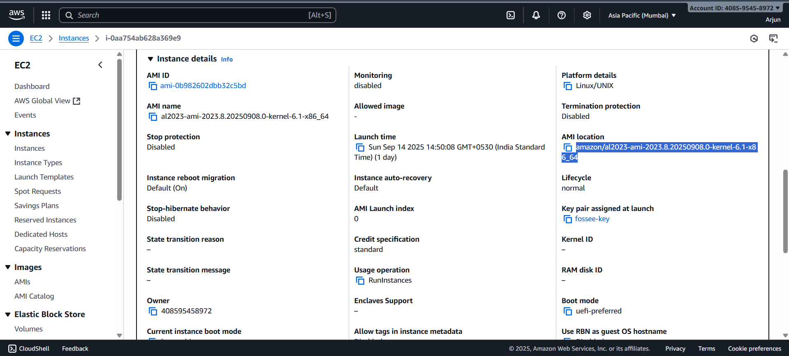
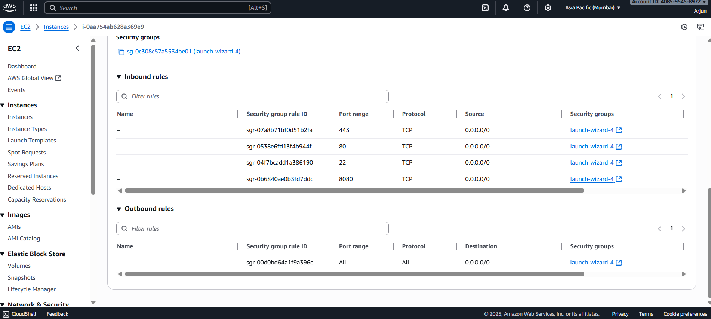

# 1. Server Setup & Hardening

## AWS EC2 Instance Creation
An AWS EC2 `t2.micro` instance was created using the Amazon Linux 2023 AMI to stay within the Free Tier.

## Firewall Configuration
The AWS Security Group was configured to allow inbound traffic for SSH (22), HTTP (80), HTTPS (443), and Keycloak (8080).

## Server Hardening
After connecting via SSH, a new user `arjun` was created and given `sudo` privileges. Root SSH login was disabled for security. All further steps were performed as this user.