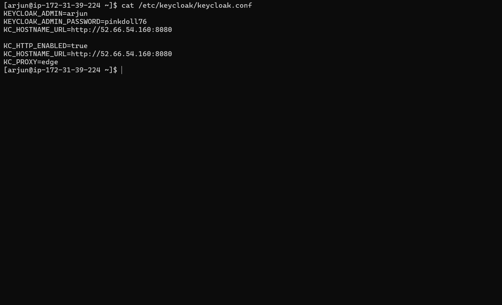
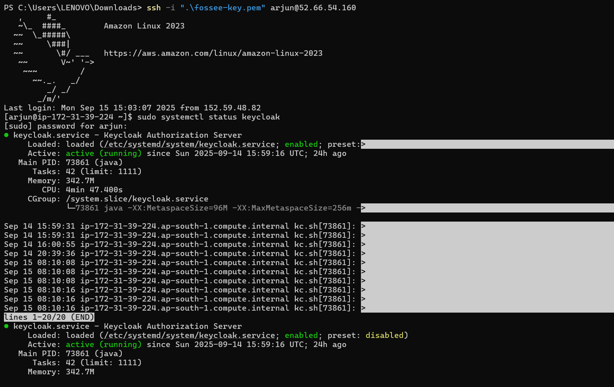
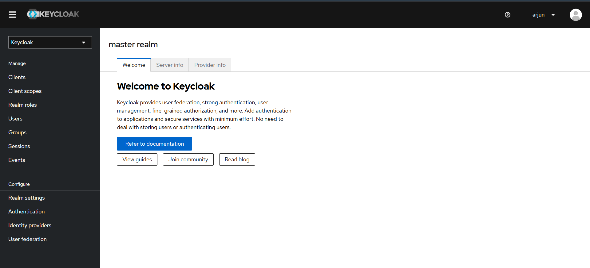

# 2. Keycloak Installation & Configuration

## Installation
Java 17 was installed, and the Keycloak 24.0.4 distribution was downloaded and placed in `/opt/keycloak`. A dedicated `keycloak` user was created to run the service.

## Service Configuration
A systemd service file was created to manage the Keycloak process. The following configuration was used to enable HTTP, set the hostname, and pre-configure the admin user.

## Final Status
The Keycloak service started successfully after extensive troubleshooting of memory, hostname, and HTTPS settings.

The service is accessible via the web.

