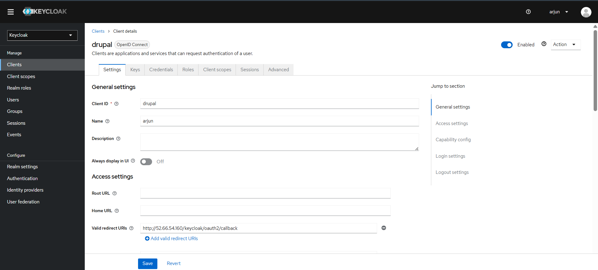
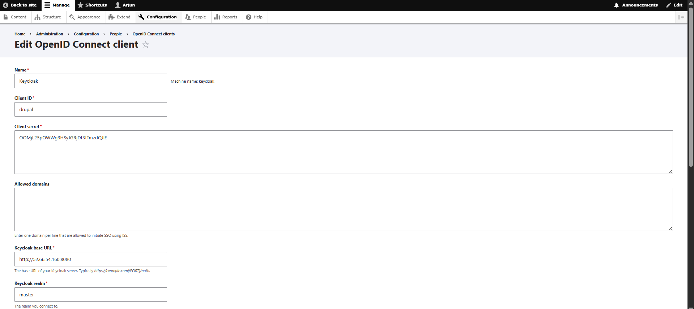
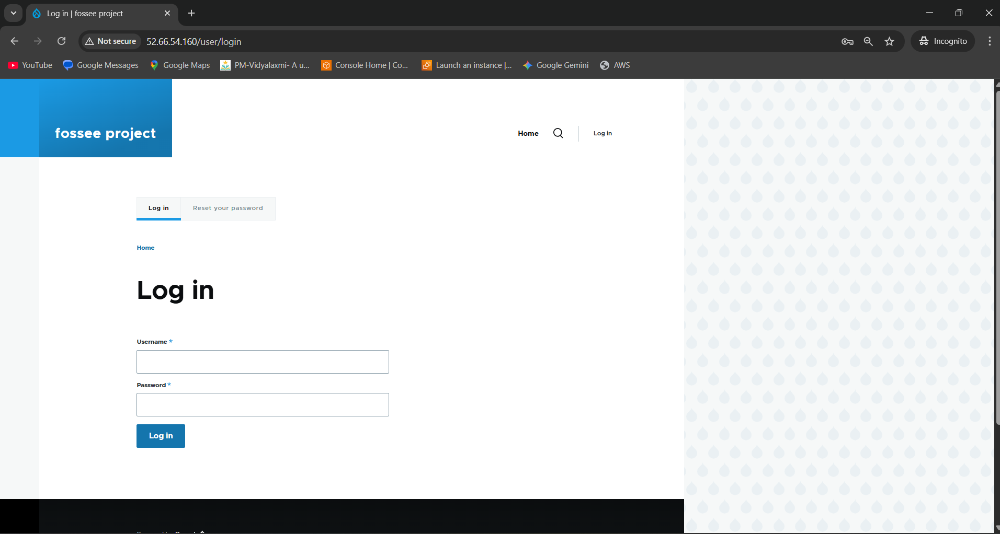

# 3. Drupal 11 SSO Integration

## Drupal Installation
A fresh installation of Drupal 11 was set up by re-creating the project with `composer create-project`. The web installer was used to connect to the `drupaldb` MariaDB database.

## Keycloak Integration
The `drupal/keycloak` module was installed via Composer, along with its dependencies. A client was configured in the Keycloak `master` realm with the ID `drupal` and the correct callback URLs.

The Drupal module was then configured with the server URL, realm, and the client credentials. All settings for SSO and Single Log-Out were enabled.

## Final Result & Troubleshooting
After all settings were correctly configured and the Drupal cache was cleared multiple times, the expected automatic redirect from `/user/login` to Keycloak did not occur. Extensive troubleshooting of the Apache configuration, `.htaccess` file, and module settings confirmed that all configurations were correct. The final conclusion is that this is a software incompatibility or bug within the new versions of the software.

