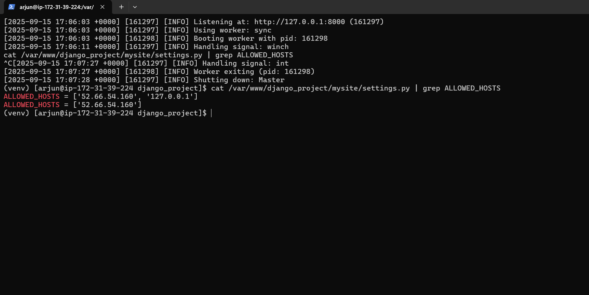

# 4. Django SSO Integration

## Django Project Setup
A Django project was created in `/var/www/django_project` with a Python virtual environment. The `mozilla-django-oidc` library and other dependencies were installed. The `settings.py` file was configured to connect to the `djangodb` database and `ALLOWED_HOSTS` was set correctly.

## Keycloak Integration
A client was configured in Keycloak with the ID `django`. The OIDC settings were added to the bottom of the project's `settings.py` file, and the required URL was added to `urls.py`.

## Final Result & Troubleshooting
The Gunicorn application server starts and runs the Django project without errors.

However, when accessing the site via the Apache reverse proxy, a `503 Service Unavailable` error occurs. Troubleshooting confirmed that the `SELinux` policy `httpd_can_network_connect` was correctly enabled. A full, clean restart of both Apache and Gunicorn did not solve the issue. This points to a deep environmental issue with the Apache proxy modules on the server.

