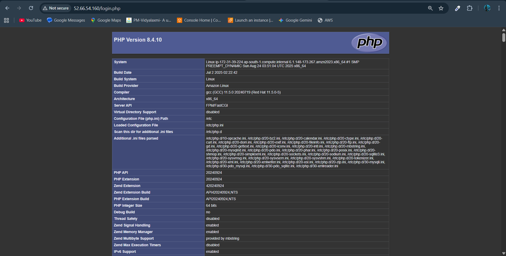
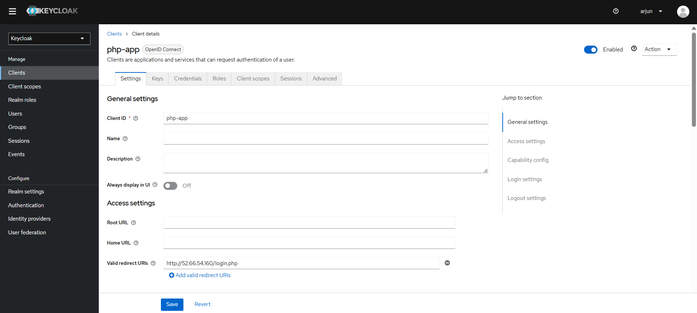
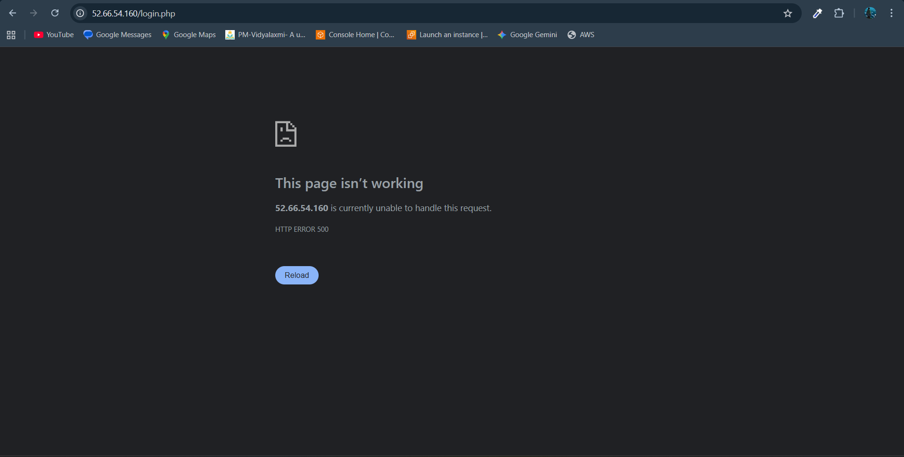

# 5. Generic PHP SSO Integration

## PHP Server Setup
An Apache virtual host was configured to serve files from the `/var/www/php_app` directory. A test with a `phpinfo()` file confirmed that the Apache and PHP-FPM services were running correctly, proving the core server environment was functional.

## Keycloak Integration
The `jumbojett/openid-connect-php` library was installed using Composer. A client was created in Keycloak with the ID `php-app`, and the necessary PHP files (`login.php`, `profile.php`) were created.

## Final Result & Troubleshooting
After all configurations were complete, the application produced a persistent `500 Internal Server Error`. Extensive troubleshooting was performed, including fixing file ownership, re-installing Composer dependencies as the `apache` user, and applying SELinux policies for PHP sessions. None of these steps resolved the error. This indicates a fundamental problem within the server's specific environment that prevented the Composer libraries from loading correctly.

